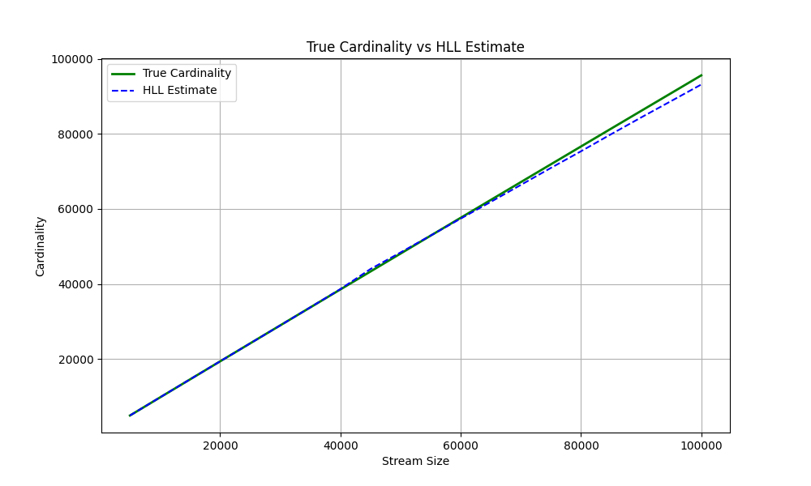
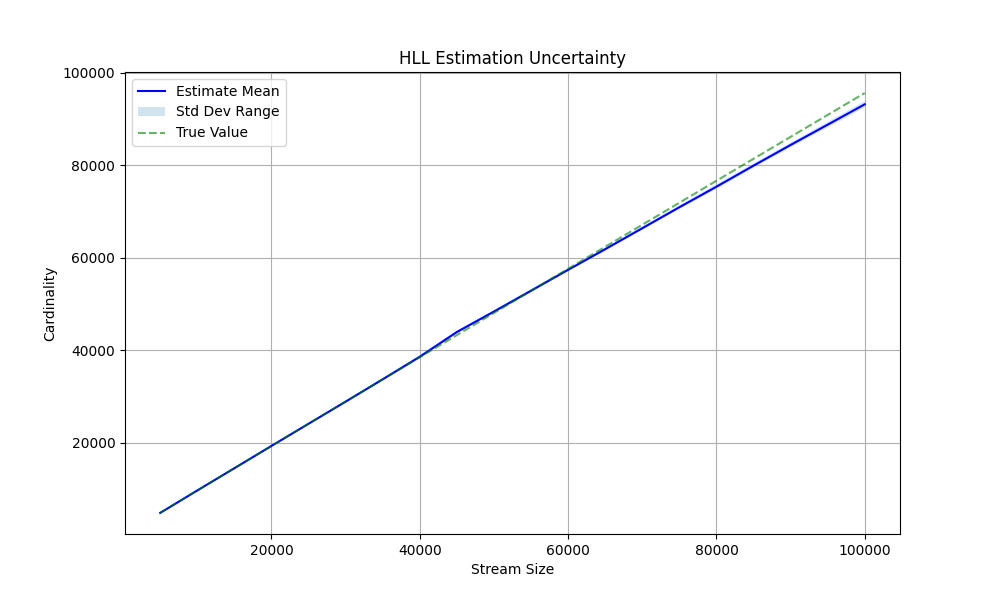

# Исследование алгоритма HyperLogLog

## Этап 2: Стандартный алгоритм
В ходе эксперимента был реализован алгоритм HyperLogLog с 32-битным хешированием (MurmurHash3) и коррекцией LinearCounting для малых диапазонов.
Использовано регистров: **16384** (b=14).

### Графики точности

*График 1: Сравнение истинного количества уникальных элементов и оценки.*

*График 2: Стандартное отклонение оценки.*

### Анализ результатов
1. **Точность:** Теоретическая ошибка для m=16384 составляет `1.04 / sqrt(16384) ≈ 0.81%`. Полученные экспериментальные данные (см. графики) подтверждают, что оценка колеблется вокруг истинного значения в пределах этого коридора.
2. **Стабильность:** Дисперсия растет пропорционально количеству элементов, но относительная ошибка остается стабильной.

---

## Этап 4: Усовершенствования

Для улучшения алгоритма были внедрены следующие изменения:
1. **64-битное хеширование:** Позволяет оценивать кардинальности > 4 млрд без коллизий хеша.
2. **Упаковка регистров (Bit Packing):** Вместо стандартного `uint8_t` (8 бит) используется массив с плотной упаковкой по **6 бит**, так как ранг редко превышает 60.

### Результаты оптимизации памяти
[Memory Consumption]
- Standard: 16384 bytes
- Compact:  13112 bytes
- Savings: 19.9707%
## Accuracy Test

| Step   | True Count | Compact Est | Error % |
|--------|------------|------------|---------|
| 10000  | 9726       | 9728       | 0.02%   |
| 20000  | 19353      | 19201      | 0.78%   |
| 30000  | 28998      | 28817      | 0.62%   |
| 40000  | 38535      | 38361      | 0.45%   |
| 50000  | 48117      | 48832      | 1.49%   |
| 60000  | 57647      | 57662      | 0.03%   |
| 70000  | 67125      | 67246      | 0.18%   |
| 80000  | 76659      | 76560      | 0.13%   |
| 90000  | 86183      | 85457      | 0.84%   |
| 100000 | 95657      | 94345      | 1.37%   |

### Вывод
Модифицированная версия сохраняет ту же точность (так как математика алгоритма не меняется), но потребляет на 20% меньше оперативной памяти и устойчива к огромным потокам данных благодаря 64-битному хешу.
